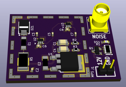
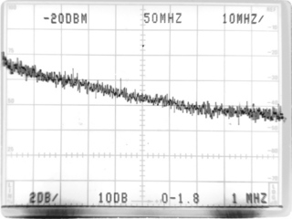

# Noise source, rev 1

Noise source for filter/amplifier testing, 1 MHz to 1 GHz. CC0/Public domain.

Consider rev 1 a work in progress; a second revision is needed before you can make this.

## Plots

Output: -30 dBm ± 2 dBm from 200 MHz to 1.2 GHz

Output: -25 dBm to -29 dBm from 1 MHz to 100 MHz

## Getting it

You probably don't want this revision. It has a bug: it oscillates around 1.6 GHz. A ferrite bead in the signal path damped this to the point where it's just a slight hump in the output spectrum (as seen above). I'm saving the existing Rev 1 PCBs, which require this modification, for distribution among friends on IRC. Rev 2 will have footprints for a few types of matching/damping circuits I plan to try between the noise diode and the first amplifier.

The PCB is designed to allow experimentation with different noise diodes. I built two variants. One shoves a lot of current through a [Panasonic DZ2410000L](http://www.semicon.panasonic.co.jp/ds4/DZ24100_E.pdf) 10V Zener diode, roughly along the lines of a Maxim application note presenting a similar circuit. Performance was quite poor. The second uses the emitter-base junction of an [MMBTH10](https://www.fairchildsemi.com/datasheets/MM/MMBTH10.pdf) RF transistor in reverse bias with a 1k source resistor, with much better performance. I recommend the latter.

## Assembly

Assembly is fairly obvious, just use the schematic as reference. For revision 2 I'll render a nice assembly diagram.

Revision 1 requires the insertion of a ferrite bead between DZ1 and C3. You'll have to cut the trace on the PCB and solder it in. I don't have a part number for the one I used, so this will require a bit of experimentation.

## Parts

Reference | Value | Manuf | MPN | Crit | Description
---|---|---|---|---|---
C1, C4 | 10µF | Murata | GRM319R6YA106KA12D | N | Power decoupling
C2, C3, C5, C6, C7, C8 | 68nF | Generic | 68nF 50V ≥X5R | N | RF {,de}coupling
DS1 | Blue | OSRAM | LB Q39G-L2OO-35-1 | N | Power LED
DZ1 | MMBTH10 | Fairchild | MMBTH10 | Y | Noise diode
E1, E2 | 150Ω at 100 MHz | Laird | LI1806C151R-10 | Y | RF filtering
J1 | +12V | Generic | 2-pin 100mil male header, unshrouded | N | Power input pins
J2 | SMA | TE Conn | 5-1814400-1 | N | RF output
MP1 | Shield | Laird | BMI-S-203-F and BMI-S-203-C | Y | RF shield
Q1 | PMOS | Vishay | SI2309CDS | N | Reverse polarity protector
R1 | 220kΩ | Generic | 220kΩ 5% 4x0603 (1206) | N | 4x 220k resistor network for general biasing
R2, R3 | 1Ω | Generic | 1Ω 5% 0603 | N | Damping impedance for C1, C4
R5 | 1kΩ | Generic | 1kΩ 5% 0603 | N | Noise diode bias resistor
U1 | 5V regulator | Fairchild | MC78M05CDTX | N | Regulator for MMICs
U2, U3 | RF amplifier | NXP | BGA2869 | Y | Main RF amplifiers

### Part selection comments

**DZ1:** The main noise diode. This is the most critical part in determining the output performance. The PCB is designed to let you experiment with different diodes, but to get the results I did, you should use an MMBTH10 transistor reverse-biased (emitter pin at DZ1 cathode pad, base pin at DZ1 anode pad).

**E1, E2:** Ferrite beads can be impressively poor under DC bias. If you must choose an alternative part for these, make sure to check the original datasheet for both impedance-vs-frequency and impedance-vs-DC-current and find something similar.

**U2, U3:** These are the main RF amplifiers and play a key role in determining performance. The original performance measurement was made with an NXP BGA2869. NXP has a line of similar amplifiers with the same pinout; if you're adventurous you could experiment with them.

**DS1:** I used a blue LED. A lot of people fuckin' *hate* blue LEDs. If you're one of them, pick a different LED here. Because blue LEDs are usually extremely efficient, you'll probably want to increase the driver current. R1 is used to set this current; select it to give the desired current when 12V-VF(LED) is applied across it. (The other three units of R1 are used as a voltage divider and their actual resistance doesn't matter; this is why R1 can be freely changed.)

**MP1:** The RF shield is listed as "critical" only because it is the only part number likely to fit the PCB footprint. If you manage to find another, go ahead and use it.

### Customizable bits

The power LED can be replaced with any color 0603 LED, if you hate blue. Different colors will require different bias currents; select R1 to provide the desired current.
